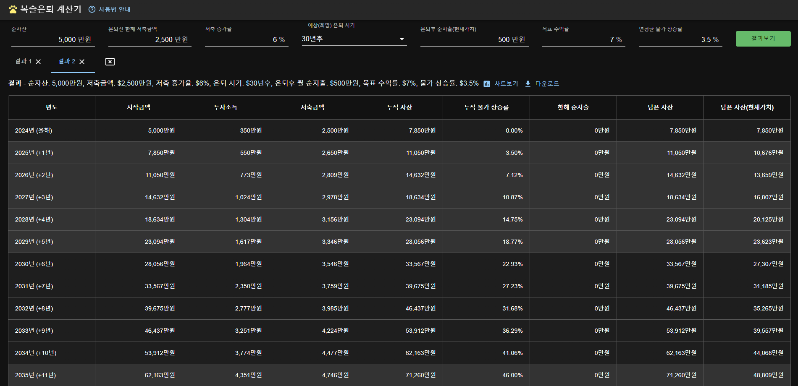
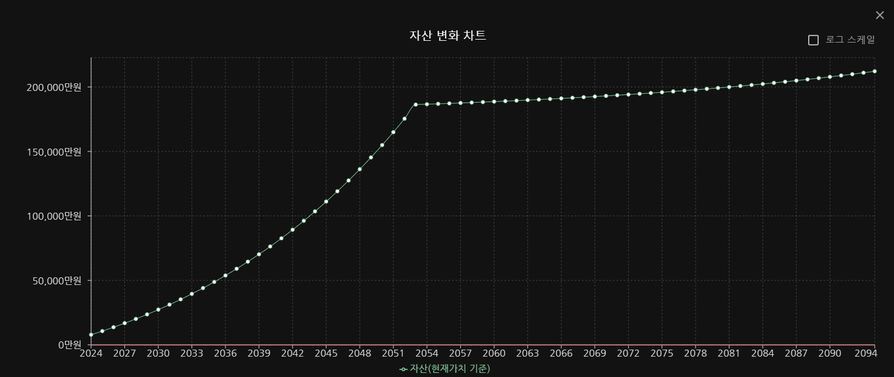

# 복슬은퇴 계산기

## 1. 주요기능

지금부터 은퇴 후 생활까지 자신의 자산 변화를 어림짐작으로 계산하는 프로그램입니다.

## 2. 실행 및 빌드

### 2.1. 초기셋팅

```shell
$ npm install
```

### 2.2. 실행 방법

```shell
$ npm start
```

### 2.3. 빌드 방법

```shell
$ npm run build
```

- 빌드 결과는 `/build` 폴더에 생성됨

### 2.4. 빌드 결과 실행

```shell
$ npm install -g serve # 최초 1번만 실행
$ serve -s build
```

실행중에 아래 오류가 발생하면

```
serve -s build
serve : 이 시스템에서 스크립트를 실행할 수 없으므로 C:\Users\{사용자}\AppData\Roaming\npm\serve.ps1 파일을 로드할 수 없습니다. 자세한 내용은 about_Execution_Policies(https://go.microsoft.com/fwlink/?LinkID=135170)를 참조하십시오.
위치 줄:1 문자:1
+ serve -s build
+ ~~~~~
    + CategoryInfo          : 보안 오류: (:) [], PSSecurityException
    + FullyQualifiedErrorId : UnauthorizedAccess
```

PowerShell을 관리자 모드로 실행

```
Set-ExecutionPolicy -ExecutionPolicy RemoteSigned -Scope CurrentUser
serve -s build
```

## 3. 주요화면

- 계산 결과
  

- 자산 변화 차트
  

## 4. 개발환경

- [typescript](https://www.typescriptlang.org)
- [react](https://ko.legacy.reactjs.org)
- [Material-UI](https://mui.com/)

## 5. 각종 통계 자료

- [기대수명](https://www.index.go.kr/unity/potal/indicator/IndexInfo.do?clasCd=2&idxCd=4234)
- [소비자물가 상승률](https://www.index.go.kr/unify/idx-info.do?idxCd=4226) - 최근 10년(2014 ~ 2023) 평균 물가상승률 1.37%
- [가구 순자산](https://www.index.go.kr/unity/potal/indicator/IndexInfo.do?clasCd=10&idxCd=F0139)
- [성별 연령대별 소득](https://kosis.kr/statHtml/statHtml.do?orgId=101&tblId=DT_1EP_2010&conn_path=I2)
- [가구소비지출](https://kosis.kr/visual/nsportalStats/detailContents.do?statJipyoId=3695&vStatJipyoId=5129&listId=F)
  - [가구 인원별 소득, 소비지출](https://kosis.kr/statHtml/statHtml.do?orgId=101&tblId=DT_1L9U005&vw_cd=MT_ZTITLE&list_id=&scrId=&seqNo=&lang_mode=ko&obj_var_id=&itm_id=&conn_path=E1&docId=0382660325&markType=S)
- [서울시 은퇴 후 적정 생활비](https://data.seoul.go.kr/dataList/10414/S/2/datasetView.do)
- [국민연금 급여지급통계](https://www.nps.or.kr/jsppage/stats/stats_map.jsp)
- [국민연금 평균가입기간](https://www.yna.co.kr/view/AKR20231010075000530) - 2022년 기준 평균 231개월 납부
